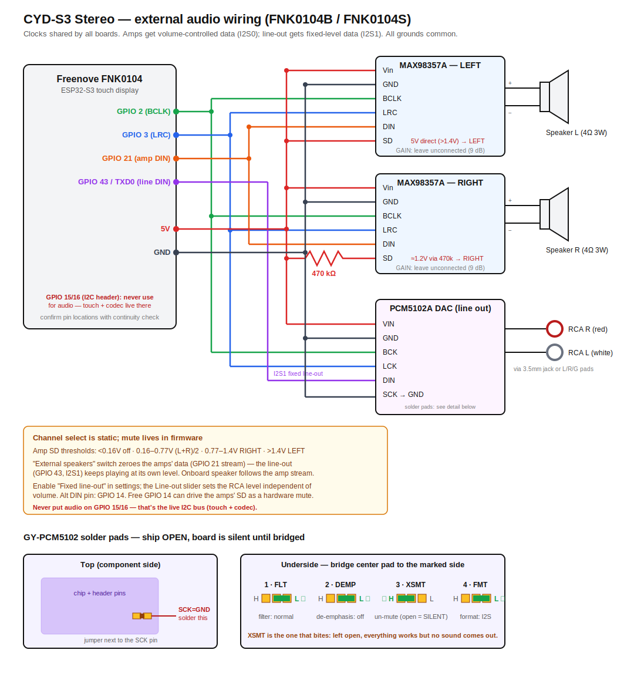

# Hardware Guide

Resilient stereo internet-radio player built on the Freenove FNK0104 ESP32-S3 touch displays.

> **Supported variants:** the firmware builds for both the 2.8" **FNK0104B**
> (`fnk0104b`, the default env and the hardware this project is developed/tested on)
> and the 4.0" **FNK0104S** (`fnk0104s`). Touch, audio, SD, and the external-I2S pins
> are identical across both (verified against both schematics); only the display
> driver/resolution differs, handled by the build env.

## Board comparison (from the original selection)

Compared using the per-variant schematics in the
[Freenove_ESP32_S3_Display repo](https://github.com/Freenove/Freenove_ESP32_S3_Display):

| Variant | Display | Driver | Free GPIOs on external connectors | Verdict |
|---|---|---|---|---|
| FNK0104A/B | 2.8" 240x320 | ILI9341 | — | Screen too small for the VU-meter view |
| FNK0104N | 3.5" 320x480 | ST77922 (QSPI) | GPIO 45, 46 only (both strapping pins) | QSPI display eats the spare pins; exotic driver |
| **FNK0104S** | **4.0" 320x480** | **ST7796 (SPI)** | **GPIO 2, 3, 14, 21** | **Best-supported driver, most free pins** |

### Key specs (verified from schematic + Freenove flashing scripts)

- **MCU:** ESP32-S3R8 — dual-core 240 MHz, WiFi, **8 MB octal PSRAM**
- **Flash:** **16 MB** (confirmed from `Upload_Xiaozhi_Bin/4.0inch/upload_xiaozhi_bin.py` in the Freenove repo, which also ships an OTA partition table) — comfortable for dual OTA app slots + LittleFS
- **Display:** 4.0" IPS 320x480, ST7796, SPI
- **Touch:** FT6336G capacitive, I2C
- **Audio (onboard):** ES8311 codec (mono DAC) + SC8002B amp -> PH1.25 speaker connector.
  I2S wired internally on GPIO 4 (MCLK), 5 (BCK), 7 (WS), 8 (DOUT), 6 (DIN).
  **GPIO 1 is the SC8002B SHUTDOWN pin — active high: LOW = amp on, HIGH = off**
  (Freenove's silk/docs call it "AP_ENABLE", which is misleading).
  The firmware drives the onboard codec from the same I2S bus as the external DACs by
  mirroring the bus onto the codec pins via the S3's GPIO matrix (MCLK on GPIO 4 goes to
  the codec directly), so the mono speaker plays alongside the stereo outputs and has its
  own on/off toggle. Two bring-up gotchas baked into the firmware: the ES8311 needs MCLK
  running **before** codec register init, and its I2C lives on the same bus as the touch
  controller (all codec I2C stays on core 1).
- **Also onboard:** micro-SD slot (4-bit SDMMC), MEMS microphone, WS2812B RGB LED,
  TP4054 LiPo charger + JST battery connector, USB-C (native USB — serial console does not
  consume UART0), boot/reset keys
- **External connectors:** UART (TXD0/RXD0 + 5V/GND), Extended IO (free GPIOs), I2C
  (shared bus with touch + codec). Kit includes 2x 4P and 1x 2P cables that fit these.

## Stereo audio add-ons

The onboard ES8311 is a **mono** codec, so stereo comes from external I2S devices on a second
I2S bus. All three boards below share the same three wires — I2S clock/data lines drive
multiple listeners happily — giving speaker output and RCA line-out simultaneously.

### Parts list

| # | Part | Qty | ~Price | Notes |
|---|---|---|---|---|
| 1 | Freenove FNK0104S (4.0" touch) | 1 | ~$27 | Includes 4P/2P cables + one mono speaker |
| 2 | MAX98357A I2S 3 W amp breakout (Adafruit #3006 or clone) | 2 | ~$6 ea | One jumpered Left, one Right |
| 3 | Full-range speakers 4 Ω 3 W (enclosed) | 2 | ~$4–10 ea | Enclosures matter for sound |
| 4 | PCM5102A DAC board ("GY-PCM5102" purple module) | 1 | ~$8 | 2.1 Vrms stereo line-out, 112 dB SNR |
| 5 | 3.5mm-to-RCA stereo cable (or panel-mount RCA jack pair) | 1 | ~$5 | PCM5102A board has a 3.5mm jack; RCA jacks wire to its L/R/GND pads |
| 6 | USB-C PSU 5 V / 3 A + data-capable USB-C cable | 1 | ~$10 | Board + display + both amps at volume needs headroom |
| 7 | Perfboard/breadboard + jumpers / JST-PH pigtails | — | ~$5 | Amps mount here; board side uses included 4P cables |
| 8 | Optional: ground-loop isolator (1:1 audio transformer, inline) | 1 | ~$10 | Only if hum appears when feeding grounded station gear |
| 9 | Optional: 3.7 V LiPo w/ JST connector | 1 | ~$8 | Board has a charger onboard — battery backup for free |

### Wiring

One I2S bus fans out to all three audio boards in parallel. No soldering on the Freenove board —
signals come off the external connectors via the included 4P cables.

| Board pin | MAX98357A x2 | PCM5102A |
|---|---|---|
| GPIO 2 | BCLK | BCK |
| GPIO 3 | LRC | LCK |
| GPIO 21 | DIN | DIN |
| 5 V | Vin | VIN |
| GND | GND | GND |
| GPIO 14 | SD: **direct** to LEFT amp, **via 220 kΩ** to RIGHT amp | — |

**SD pin: mute and channel select on one pin.** The MAX98357A's SD input (internal 100 kΩ
pulldown) sets both: <0.16 V = off, 0.16–0.77 V = (L+R)/2 mix, 0.77–1.4 V = right channel,
>1.4 V = left channel. The GPIO 14 wiring above exploits that:

- GPIO 14 **HIGH** (speakers on): left amp sees 3.3 V (>1.4 → LEFT), right amp sees ~1.0 V
  through the 220 kΩ divider against the internal 100 kΩ (0.77–1.4 → RIGHT).
- GPIO 14 **LOW** (speakers off): both SD pins at 0 V → both amps shut down; the PCM5102A
  line-out keeps playing (that's the firmware's "External speakers" switch).
- **Adafruit breakouts only:** they ship a 1 MΩ SD→Vin resistor on the board — remove it,
  or when muted the right amp floats to ~0.3 V (mix mode, quietly still playing). The bare
  clone boards without that resistor need no change.
- **Don't want hardware mute?** Skip GPIO 14: left amp SD → 5 V direct, right amp
  SD → 5 V via 470 kΩ. (The firmware speaker switch then has no effect.)

**PCM5102A (GY-PCM5102 module): the solder pads ship OPEN — the board is silent until
you solder them.** Verified on real hardware:

- **Bottom side:** bridge the `SCK=GND` jumper pad (gives the chip its internal PLL clock;
  floating SCK = no output at all).
- **Top side:** bridge the four config pad pairs (`H?L` pads next to FLT/DEMP/XSMT/FMT):
  **FLT→L, DEMP→L, XSMT→H, FMT→L**. XSMT left open = soft-mute engaged = silence even
  with everything else correct.

PCM5102A one-time setup:

- Tie **SCK to GND** (solder bridge on the purple board) so it generates its own master clock.
- Verify the four config solder bridges are at defaults (FLT=normal, DEMP=off, XSMT=un-mute,
  FMT=I2S) — boards usually ship correct.

### Fixed line-out level (optional, one wire)

By default all outputs share one I2S data line, so the UI volume moves the RCA level too.
For a volume-independent line-out (studio-feed style), enable **"Fixed line-out level"** in
the web config and move **one wire**: PCM5102A **DIN from GPIO 21 to GPIO 43** (the TXD0
pin on the UART connector — free because the console runs over native USB). BCK/LCK stay
shared on GPIO 2/3.

How it works: the S3's second I2S controller runs as a TX slave locked to the same
bus clocks and carries full-scale samples to the DAC, while the amps' data line gets the
volume-scaled stream. The line-out then has its own **"Line out" level slider** (Settings
screen and web UI, 0–100%) that sets the RCA output level independent of the UI volume —
handy for matching the station mixer's input once, then never touching it.

With the toggle off, nothing changes: the original all-shared wiring keeps working.

### Behavior notes

- **Volume affects speakers and line-out together** — volume is applied digitally to the single
  I2S stream. Fine for a station feed; if a fixed-level line-out with independent speaker volume
  is ever needed, the S3's two I2S peripherals + remaining free GPIOs allow a split-bus design
  later with no new board.
- Firmware will expose a config toggle to mute the speaker amps (SD_MODE pins on a spare GPIO)
  so the unit can run as a silent RCA feed.
- The onboard mono speaker stays usable as a fallback/test output via the ES8311; its amp
  (GPIO 1) is muted when the stereo pair is active.

## Validated display configs (from real-hardware bring-up)

| Variant | Driver define | Notes |
|---|---|---|
| FNK0104B 2.8" | `ILI9341_2_DRIVER`, `TFT_INVERSION_ON`, `TFT_RGB_ORDER=TFT_BGR`, MISO 13, **27 MHz SPI** | Freenove ships 40 MHz; 27 MHz used for margin. Inversion is required (without it the panel renders as a negative). |
| FNK0104S 4.0" | `ST7796_DRIVER`, `TFT_INVERSION_ON`, MISO -1, 80 MHz SPI | From Freenove's setup; not yet verified on physical hardware. |

Shared display pins (both variants): MOSI 11, SCLK 12, CS 10, DC 46, RST tied to board
reset, backlight PWM on GPIO 45 (LEDC, driven by firmware for brightness control).

## First-power-up checklist (new external audio parts)

1. Boot with the current firmware — display, touch, WiFi, and onboard speaker are already
   validated on the 2.8" board. (Optional: enable "Display self-test at power-on" in the
   web config for the color-cycle + I2C probe diagnostics.)
2. Continuity-check which Extended IO / aux connector pins carry GPIO 2/3/14/21 — the schematic's
   connector labels are ambiguous about the exact pin-to-connector mapping (worst case, UART pins
   GPIO 43/44 are also free since the console runs over native USB).
3. Wire the amps/DAC per the table above and play a stream — the firmware already drives
   the external bus, so stereo should be sound-on-first-boot.

## References

- [FNK0104 store page](https://store.freenove.com/products/fnk0104)
- [FNK0104 documentation](https://docs.freenove.com/projects/fnk0104/en/latest/index.html)
- [Freenove_ESP32_S3_Display GitHub repo](https://github.com/Freenove/Freenove_ESP32_S3_Display)
  — schematics in `Schematic/`, chip datasheets (ES8311, FT6336G, ST7796, …) in `Datasheet/`
